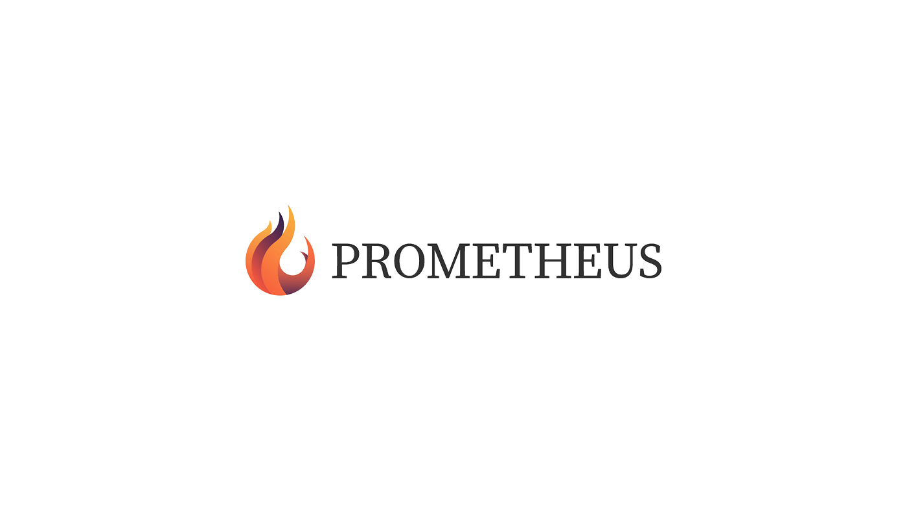

# Prometheus

<p align='center'>

</p>

<p align="center">


v8.9.0-b561fe.svg">
v5.5.1-000000.svg">
1.13.0-orange.svg">
3.0.0-80d4f9.svg">


</p>

<p align="center">
<a href="https://github.com/halfrost/Prometheus/blob/master/LICENSE"></a>
<a href="https://halfrost.com"></a>
<a href="http://weibo.com/halfrost"></a>
<a href="https://twitter.com/halffrost"></a>
<a href="https://www.zhihu.com/people/halfrost/activities"></a>

<a href="https://github.com/halfrost/Prometheus/pulls"></a>
</p>

Prometheus Ghost theme is clean and very modern. The design is highly focused on typography. But there is also the perfect combination of image and white space in this design. This theme is perfect for a personal and professional blog. Also, the theme will fit in with perfectly with any fashion blog, food blog, movie blog, music blog or any other you can imagine. You could use this theme for an online magazine or journal also.

Installing and customizing this theme is very easy. All required information is provided in the documentation.

[Live Demo](https://halfrost.com) is here.

## First tell a story

<p align='center'>

</p>


In Greek mythology, Prometheus (/prəˈmiːθiəs/; Ancient Greek: Προμηθεύς, [promɛːtʰéu̯s], possibly meaning "forethought") is a Titan, culture hero, and trickster figure who is credited with the creation of humanity from clay, and who defies the gods by stealing fire and giving it to humanity as civilization. Prometheus is known for his intelligence and as a champion of humankind and also seen as the author of the human arts and sciences generally. He is sometimes presented as the father of Deucalion, the hero of the flood story.

The punishment of Prometheus as a consequence of the theft of fire is a popular subject of both ancient and modern culture. Zeus, king of the Olympian gods, sentenced the Titan to eternal torment for his transgression. The immortal was bound to a rock, where each day an eagle, the emblem of Zeus, was sent to eat Prometheus' liver, which would then grow back overnight to be eaten again the next day (in ancient Greece, the liver was often thought to be the seat of human emotions). Prometheus was eventually freed by the hero Heracles.

In another myth, Prometheus establishes the form of animal sacrifice practiced in ancient Greek religion.

Evidence of a cult to Prometheus himself is not widespread. He was a focus of religious activity mainly at Athens, where he was linked to Athena and Hephaestus, other Greek deities of creative skills and technology.

In the Western classical tradition, Prometheus became a figure who represented human striving, particularly the quest for scientific knowledge, and the risk of overreaching or unintended consequences. In particular, he was regarded in the Romantic era as embodying the lone genius whose efforts to improve human existence could also result in tragedy: Mary Shelley, for instance, gave The Modern Prometheus as the subtitle to her novel Frankenstein (1818).


## Why is this name?

<p align='center'>

</p>

Because of Prometheus above experience, Prometheus is also the symbol of forethought, diligent and courageous. I hope who use this ghost theme would bring his website wisdom.

## Theme General features

<p align='center'>

</p>

- **Ready for latest version of Ghost 3.0 and above**.
- **Fully support new membership and subscription feature**.
- **User select-able light and dark mode**.
- **Fully support Progressive Web Apps**.
- **Clean and clutter free modern design**.
- **Minimal, highly content focused, reader friendly and eye soothing**.
- **100% responsive, looks nice in any size of device**.
- **supports image logo**.
- Previous and next post link in single post view.
- Fully supports ghost Koenig Editor.
- Supports inbuilt navigation system.
- Blog Cover and blog description.
- Tag image and tag description.
- Author cover image, avatar, bio and social links.
- Multi author support.
- search functionality.
- Responsive youtube, vimeo, soundcloud, mixcloud.
- Beautiful Code Highlight.
- Static pages.
- Custom author archive page template.
- Custom tag archive page template.
- Custom subscribe page.
- Custom error page.
- Custom AMP template
- Cross-Browser Compatibility.
- Comment with disqus.
- Post sharing.
- Ghost subscription.
- Contact form using formspree
- Google font.
- SVG icons.
- Well commented and well structured coding.
- Development files included. Easy to customize.
- Developer friendly. Built with gulp and SASS.

## Supports inbuilt Ghost features

<p align='center'>

</p>

- Translation ready English and Polish included.
- Members & subscriptions.
- Publication title and description.
- Publication logo and cover.
- Post, page, tag and author page.
- Author cover, avatar, bio, location, website and social accounts.
- Tag cover and description.
- Primary tag in post-cards.
- Multiple authors.
- Koenig editor.
- Markdown card.
- Bookmark card.
- Gallery card.
- Image card with normal, wide and full width.
- Secondary navigation.
- Featured post and page.
- Reading time.
- Next and previous post navigation.
- Social accounts.
- Content API v3.


## Members & subscriptions

<p align='center'>

</p>


- Custom membership page.
- Custom account page for member.
- Custom account page for paid-member.
- Custom sign-in page.
- Custom sign-up page.
- Custom newsletter page.
- Custom Call-to-Action in post for member.
- Custom Call-to-Action in post for paid-member.
- Pricing tables: Free, Monthly, Yearly.
- Pricing tables in custom account and membership page.
- 6 colors for Call-to-Action.
- Sign-in, sign-up, subscribe and checkout notifications.
- Account details.
- Cancel & continue subscription button.
- Members and Paid-members labels in post-cards.
- Option to edit billing info.
- Custom currency USD, AUD, CAD, EUR, GBP, INR.


## Comprehensive picture optimization

Most of my pictures are on the CDN of Qiuniu, which has sponsored my blog for several years. I would like to thank you again. Images have always been the main part of network requests. This time, several processings have been done on image loading.

### 1. The main pictures are `lazyload:g`

Delayed loading, loading only when sliding to the visible area, Ghost is not convenient to change the Markdown rendering engine, but you can write html directly when editing, and you need to write the code directly in the editor.


```language-html
<!-- Set the alt value to cover or full-img to control the initial thumbnail of the article and whether it fills the screen -->

```

### 2. WebP picture and resolution adaptation

According to whether the device browser supports WebP and whether it is a mobile phone, using the graphics processing interface of the cloud to load pictures in different formats and resolutions, the size of the pictures is greatly optimized.

``` language-javascript
/*Use js to determine whether the browser supports webP format images*/
webPCheck: function(feature, callback) {
        var TestImages = {
            demo: "UklGRkoAAABXRUJQVlA4WAoAAAAQAAAAAAAAAAAAQUxQSAsAAAABBxAREYiI/gcAAABWUDggGAAAADABAJ0BKgEAAQABABwlpAADcAD+/gbQAA=="
        };
        var img = new Image();
        img.onload = function() {
            var result = (img.width > 0) && (img.height > 0);
            console.log('支持Webp');
            ImageSmartLoader.isWebPSupported = true;
            ImageSmartLoader.webPLoader();
        };
        img.onerror = function() {
            ImageSmartLoader.isWebPSupported = false;
            ImageSmartLoader.webPLoader();
        };
        img.src = "data:image/webp;base64," + TestImages['demo'];
},


/*Call different by passing parameters lazyload*/
$(".lazy").lazyload({
    advanced_load: true,
    data_attribute: 'url',
    webP_load: true,
    is_scale: true,
    scale_width: 750
});

/*Reassemble the lazyload url, and call different pictures with the cloud interface*/
if (settings.advanced_load == true) {
    updatedUrl += '!';
}
if (settings.is_scale == true) {
    updatedUrl += '/fw/' + settings.scale_width;
}
if (settings.webP_load == true) {
    updatedUrl += '/format/webp';
}

```

### 3. Advanced optimization Iconfont - TODO #9


This time I re-use [Sketch](https://www.sketchapp.com) to sort out the icons of common social networking sites, and add the icons of common domestic websites such as V2EX, Zhihu, Jianshu, etc., making it more convenient to call. Generated by Alibaba Cloud [iconfont.cn](http://iconfont.cn), and the font font is deployed on Alibaba Cloud CDN. The article still adds the function of automatically marking the logo of the quoted URL.


``` language-javascript
    /*Add iconfont to the url in the article for easy identification*/
    urlIconlize: function(url) {
        var domain,
            _output;
        var iconFontTag = 'iconfont';
        var iconMap = { /*Index which can add matching rules here*/
            'twitter': iconFontTag + '-twitter',
            'qzone': iconFontTag + '-qzone',
            'weibo': iconFontTag + '-weibo',
            'facebook': iconFontTag + '-facebook',
            'github': iconFontTag + '-github',
            'douban': iconFontTag + '-douban',
            'google': iconFontTag + '-google',
            'dribble': iconFontTag + '-dribble',
            'v2ex': iconFontTag + '-v2ex',
            'zhihu': iconFontTag + '-zhihu',
            'wikipedia': iconFontTag + '-wikipedia',
            'jianshu': iconFontTag + '-jianshu',
            'youku': iconFontTag + '-youku',
            'youtube': iconFontTag + '-youtube'

        }

        for (var name in iconMap) {
            if (typeof iconMap[name] !== 'function') {
                var MapKey = name;
                if (url.indexOf(MapKey) >= 0) {
                    domain = MapKey;
                    _output = iconMap[MapKey];
                }
            }
        }

        return _output;
    },
    addIcons: function() {
        /*Add ico recognition to the blog post address url*/
        $('.single-post-inner  a:not(:has(img))').each(function(i) {
            var _src = $(this).attr('href');
            var tmp = document.createElement('a');
            tmp.href = _src;
            _selfDomain = tmp.hostname;
            General.urlIconlize(_selfDomain);
            console.log(_selfDomain);
            $(this).prepend('<i class="iconfont ' + General.urlIconlize(_selfDomain) + '"></i>');
        });
    },
```

## Theme Customization

This theme is built using Gulp to compile javascript and CSS. CSS is written in SCSS. So if you want to modify the theme color, styles or appearance or anything you want to customize, before doing that you need to setup development environment setup.

Please follow all the steps below one by one to do it.

You need to have installed **node js** and **gulp** installed in your local machine.

- If you don't have nodejs installed in your machine then visit nodejs.org and download and install latest LTS version of node js.
- After installing node js open a command prompt or terminal. Then type `node -v`. If it shows a version number then node js is installed correctly. Also enter this command `npm -v` to see npm ( comes with node js) is installed properly.
- After installing node js you need to install Gulp CLI globally in your machine. So in your terminal or command prompt enter this command. `npm install gulp-cli -g`. It may take some time, it will install Gulp CLI globally in your machine. Now you have done the environment setup.
- At this point go to the development theme folder. In downloaded zip there is a folder named "development". Within that folder you will see a folder named as the theme name. Enter in that folder and run command prompt / terminal here. Or you can navigate to this folder within already running terminal.
- Now enter command `npm install`. It may take some time. It will install all the development dependency within the project. It may show some warning, don't worry those are OK.
- At this time you are ready to modify theme, Run one more command `gulp` in the terminal. It will initially compile all files and star to watch file changes. Keep the terminal open and start customizing the theme.

## How to Change Color or CSS

In the theme folder you will find "assets > scss" folder which contains all the theme styles written in SCSS.

To change any style / css you need to modify here. In SCSS folder you will find a folder named "components" which contains a bunch of .scss files which are part of the whole theme's style. and all those files are imported in a specific order in "screen.scss" file located in "scss" folder root outside of "components" folder. please dont edit that file.

To change the Theme color please follow the steps below.

- Open the `_color-and-font.scss` file in your code editor.
- Now you have to change the color hexcode (#xxxxxx) in this file and save the file.
- If you have followed the above section of instruction ( Detail customization prerequisite), and already running terminal with the gulp command then the file changes will be detected and if there is no error in your file then it will be automatically compiled.

The `_color-and-font.scss` file looks like below.

```
/*=====================================================
    Fonts
=====================================================*/
$accent-color: #FDA403; /* theme highlight/primary color */

$theme-light: (
    bg-color: #FFFFFF,
    text-title: #161616,
    text-body: #313131,
    text-light: #929399,
);

$theme-dark: (
    bg-color: #252733,
    text-title: #FFFFFF,
    text-body: #D5D5D5,
    text-light: #929399,
);

/*=====================================================
    Fonts
=====================================================*/
$font-body: 'Noto Sans', sans-serif;
$font-title: 'Playfair Display', serif;

/*=====================================================
    Please don't edit below code if you are not sure
=====================================================*/
:root { 
    @each $name, $value in $theme-dark {
        --#{$name}: #{$value};
    }
}

[data-theme="light"] {
    @each $name, $value in $theme-light {
        --#{$name}: #{$value};
    }
}
```

After modifying the theme css when you are done and want to install the final theme in your live site, do the following.

- Go to running terminal ( terminal is navigated to development theme folder and running `gulp` command to watch the file changes )
- Press **Ctrl + C** or **Cmd + C** in your keyboard to end the running task.
- After ending running task enter this command, `gulp build`. This command will build the production ready ( live site ready ) theme package within a folder named "build".
- After doing the `gulp build` if you need you can configure the theme options ( such as disqus shortname, social links etc ) then use this command `gulp zip`. It will make a folder named "dist" and make a zip of the contents of "build" folder within "dist" folder.
- Now you can upload this newly created zip in your ghost admin panel.

## Light and dark mode

This theme comes with an uncommon and unique feature, which is toggleable light and dark mode. This option let your user choose whether they prefer dark color or light color. There preference will be saved in their browser locally. Wnenever they visit your site in future, they will see their preffered mode.

By default the theme is in dark mode, which means when user visit the site for first time, they will see the dark mode.

If you want to make the default mode to light then follow the steps below

Open `default.hbs` file from your theme folder.
Add `data-theme="light"` in the html tag at line number 2. So that the line will become like below.

```
<html lang="{{@site.locale}}" data-theme="light">
```

## Theme Translation

Ghost introduced Theme translation and blog localization feature in version 1.20.0. We implemented translation support to this theme. Please follow the steps below to translate this theme in your language. Please follow the steps below to correctly translate the theme in your language.

- Within theme folder, there is a folder named "locales". In that folder by default you will find a file named "en.json". This is the default file for english language and you have to use this file to create your own language file.
- make a copy of en.json and give a name following this format [language_code].json ( example: for french **fr.json** for German i.e. Deutsch **de.json** for Russian **ru.json** etc. )
If you are not sure about what is you language code then you can visit [this wiki page](https://en.wikipedia.org/wiki/List_of_ISO_639-1_codes) and see. Use the two letter (ISO 639-1) code.
Now open the newly created <your_language>.json file in text editor. You will see "KEY": "VALUE" format in each line.
In english language KEY and VALUE are same. Now you read the left part of the : ie. KEY part and change the tight part ie. VALUE part to your own language.
After finishing the translation Save the file and upload the theme to your site.
Go to your admin area, Visit "Genera" setting page and change the "publication Language" option. By default there is "en" for english. Add your own language code there in place of "en" and save the settings.
Visit your site, If everything goes right, you will see all the theme related text in your site is in your translated language.

## Test result

### 1. Ghost GScan – score 100 / 100

100% compatible with latest ghost

<p align='center'>

</p>

### 2. PageSpeed Insights - score Desktop 100 / Mobile 90

Desktop full score:

<p align='center'>

</p>

Mobile 95 score:

<p align='center'>

</p>

### 3. [Pingdom](https://tools.pingdom.com/) – Performance grade B (score 86) load time 1.38 second

<p align='center'>

</p>

### 4. [Gtmetrix](https://gtmetrix.com/) - PageSpeed Score A(97%)

<p align='center'>

</p>

## ♥️ Thanks

If you like this project, welcome Star!


[](https://starchart.cc/halfrost/Prometheus)


## Copyright & License


Copyright (c) 2013-2015 Ghost Foundation - Released under the MIT License.

Permission is hereby granted, free of charge, to any person obtaining a copy of this software and associated documentation files (the "Software"), to deal in the Software without restriction, including without limitation the rights to use, copy, modify, merge, publish, distribute, sublicense, and/or sell copies of the Software, and to permit persons to whom the Software is furnished to do so, subject to the following conditions:

The above copyright notice and this permission notice shall be included in all copies or substantial portions of the Software.

THE SOFTWARE IS PROVIDED "AS IS", WITHOUT WARRANTY OF ANY KIND, EXPRESS OR IMPLIED, INCLUDING BUT NOT LIMITED TO THE WARRANTIES OF MERCHANTABILITY, FITNESS FOR A PARTICULAR PURPOSE AND
NONINFRINGEMENT. IN NO EVENT SHALL THE AUTHORS OR COPYRIGHT HOLDERS BE LIABLE FOR ANY CLAIM, DAMAGES OR OTHER LIABILITY, WHETHER IN AN ACTION OF CONTRACT, TORT OR OTHERWISE, ARISING FROM, OUT OF OR IN CONNECTION WITH THE SOFTWARE OR THE USE OR OTHER DEALINGS IN THE SOFTWARE.
